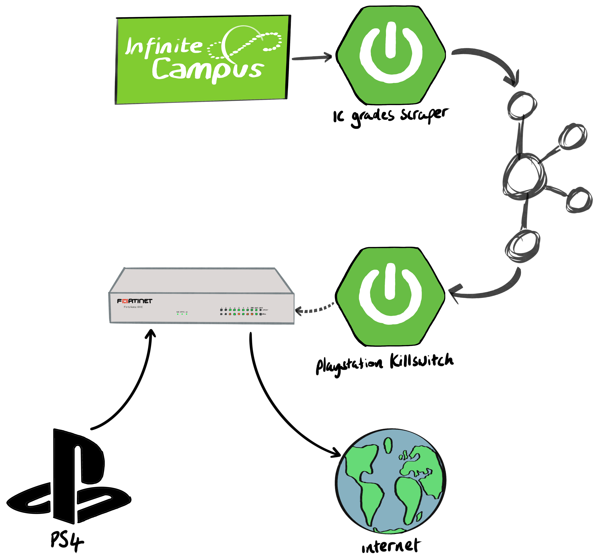

# event driven parenting

This project consists of two Spring micro-services:
1. _ic-grades-scraper_: scrapes grades from Infinite Campus into Kafka.
2. _playstation-killswitch_: streams grades from Kafka and adds a firewall rule preventing the PS4 from accessing the internet if there's a grade that's not an A or B.

Here's a video walk-though:

